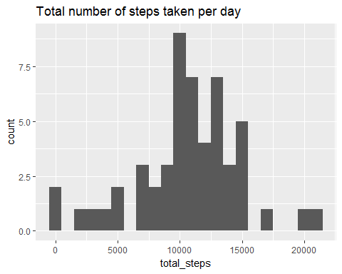
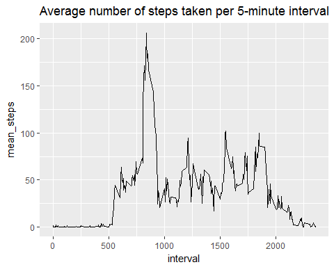
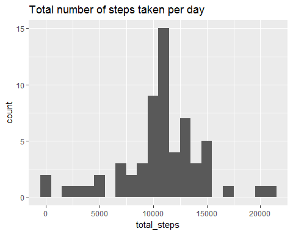
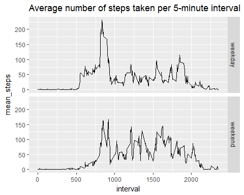

# Reproducible Research: Peer Assessment 1
####Load libraries

```r
library("knitr")
library("ggplot2")
library("dplyr")
```

####Set global options

```r
opts_chunk$set(echo = TRUE)
```


## Loading and preprocessing the data

####1.	Load the data (i.e. read.csv())

```r
data <- read.csv("activity.csv")
data$date <- as.Date(data$date)

#Show top 6 rows
head(data)
```

```
##   steps       date interval
## 1    NA 2012-10-01        0
## 2    NA 2012-10-01        5
## 3    NA 2012-10-01       10
## 4    NA 2012-10-01       15
## 5    NA 2012-10-01       20
## 6    NA 2012-10-01       25
```

####2.	Process/transform the data (if necessary) into a format suitable for your analysis

```r
data$date <- as.Date(data$date)
```

## What is mean total number of steps taken per day?
####1.	Calculate the total number of steps taken per day

```r
stepsByDate <- data %>% 
        group_by(date) %>% 
        summarize(total_steps = sum(steps))
head(stepsByDate)
```

```
## # A tibble: 6 x 2
##         date total_steps
##       <date>       <int>
## 1 2012-10-01          NA
## 2 2012-10-02         126
## 3 2012-10-03       11352
## 4 2012-10-04       12116
## 5 2012-10-05       13294
## 6 2012-10-06       15420
```

####2.	If you do not understand the difference between a histogram and a barplot, research the difference between them. Make a histogram of the total number of steps taken each day

```r
ggplot(stepsByDate, aes(total_steps)) + geom_histogram(binwidth = 1000) + 
        labs(title = "Total number of steps taken per day")
```

```
## Warning: Removed 8 rows containing non-finite values (stat_bin).
```

<!-- -->

####3.	Calculate and report the mean and median of the total number of steps taken per day

```r
#Mean steps taken per day
meanSteps <- round(mean(stepsByDate$total_steps, na.rm = TRUE), digits = 2)

#Median steps taken per day
medianSteps <- round(median(stepsByDate$total_steps, na.rm = TRUE), digits = 2)
```

Mean steps taken per day is 10766.19 and
median steps taken per day is 10765.

## What is the average daily activity pattern?
####1.	Make a time series plot (i.e. type = "l") of the 5-minute interval (x-axis) and the average number of steps taken, averaged across all days (y-axis)

```r
stepsByInterval <- data %>% 
        group_by(interval) %>% 
        summarize(mean_steps = mean(steps, na.rm = TRUE))

ggplot(stepsByInterval, aes(interval, mean_steps)) + geom_line() + 
        labs(title = "Average number of steps taken per 5-minute interval")
```

<!-- -->

####2.	Which 5-minute interval, on average across all the days in the dataset, contains the maximum number of steps?

```r
# Which 5-minute interval, on average across all the days in 
# the dataset, contains the maximum number of steps?
maxIntervall <- stepsByInterval %>% 
        arrange(desc(mean_steps)) %>% 
        head(n=1) %>% select(interval,mean_steps)
```
Interval 835 cointains maximum number of average steps 
which is 206.


## Imputing missing values
####1.	Calculate and report the total number of missing values in the dataset (i.e. the total number of rows with NAs)

```r
rows <- nrow(data)
na <- sapply(data, function(x) sum(is.na(x)))
```
Number of missing values in dataset are 2304 out of 17568.

####2.	Devise a strategy for filling in all of the missing values in the dataset. The strategy does not need to be sophisticated. For example, you could use the mean/median for that day, or the mean for that 5-minute interval, etc.
My strategy in the next step is to use the mean for that 5-minute interval.

####3.	Create a new dataset that is equal to the original dataset but with the missing data filled in.


```r
#Merge the two datasets "data"" and "stepsByInterval".
dataNAFilled <- merge(x = data, y = stepsByInterval, by = "interval", all.x = TRUE)

#Fill all NA in vairaibel "steps" with the mean value for that interval.
dataNAFilled <- dataNAFilled %>% mutate(steps = ifelse(is.na(steps), mean_steps, steps)) 
```

```
## Warning: package 'bindrcpp' was built under R version 3.4.1
```

```r
dataNAFilled <- dataNAFilled %>% select(interval, steps, date)
head(dataNAFilled)
```

```
##   interval    steps       date
## 1        0 1.716981 2012-10-01
## 2        0 0.000000 2012-11-23
## 3        0 0.000000 2012-10-28
## 4        0 0.000000 2012-11-06
## 5        0 0.000000 2012-11-24
## 6        0 0.000000 2012-11-15
```
  
####4.	Make a histogram of the total number of steps taken each day and Calculate and report the mean and median total number of steps taken per day. Do these values differ from the estimates from the first part of the assignment? What is the impact of imputing missing data on the estimates of the total daily number of steps?

```r
stepsByDateNAFilled <- dataNAFilled %>%
        group_by(date) %>%
        summarize(total_steps = sum(steps))

#Show histogram over total number of steps taken per day
ggplot(stepsByDateNAFilled, aes(total_steps)) + geom_histogram(binwidth = 1000) +
        labs(title = "Total number of steps taken per day")
```

<!-- -->

```r
#Mean steps taken per day
meanStepsNAFilled <-
        round(mean(stepsByDateNAFilled$total_steps, na.rm = TRUE),
              digits = 5)

#Median steps taken per day
medianStepsNAFilled <-
        round(median(stepsByDateNAFilled$total_steps, na.rm = TRUE), digits = 5)
```

Mean steps taken per day with missing values filles are 10766.19 whish can be compared with earlier result that was 10766.19 without missing values filled. 

Median steps taken per day with missing values filles are 10766.19 whish can be compared with earlier result that was 10765 without missing values filled. 

The impact of filling missing values with mean values are negligible both for mean and median.


## Are there differences in activity patterns between weekdays and weekends?
####1.	Create a new factor variable in the dataset with two levels - "weekday" and "weekend" indicating whether a given date is a weekday or weekend day

```r
dataNAFilled <-
        dataNAFilled %>% mutate(daytype = as.factor(ifelse(
                as.POSIXlt(date)$wday %in% c(0, 6), "weekend", "weekday"
        )))
str(dataNAFilled)
```

```
## 'data.frame':	17568 obs. of  4 variables:
##  $ interval: int  0 0 0 0 0 0 0 0 0 0 ...
##  $ steps   : num  1.72 0 0 0 0 ...
##  $ date    : Date, format: "2012-10-01" "2012-11-23" ...
##  $ daytype : Factor w/ 2 levels "weekday","weekend": 1 1 2 1 2 1 2 1 1 2 ...
```

####2.	Make a panel plot containing a time series plot (i.e. type = "l") of the 5-minute interval (x-axis) and the average number of steps taken, averaged across all weekday days or weekend days (y-axis). 

```r
stepsByIntervalNAFilled <- dataNAFilled %>%
        group_by(interval, daytype) %>%
        summarize(mean_steps = mean(steps, na.rm = TRUE))

ggplot(stepsByIntervalNAFilled, aes(interval, mean_steps)) +
        geom_line() +
        labs(title = "Average number of steps taken per 5-minute interval") +
        facet_grid(daytype ~ .)
```

<!-- -->
